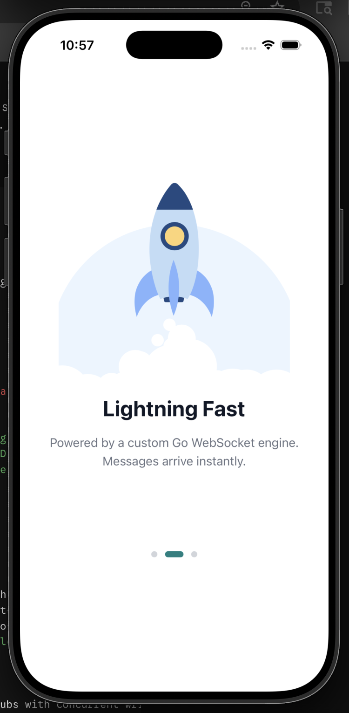
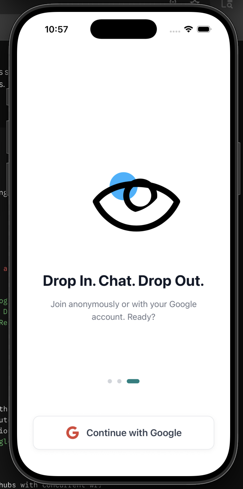

# DropRoom Mobile & Backend

DropRoom is a high-performance, cross-platform, real-time messaging application featuring secure authentication, live chat rooms, and dynamic profile synchronizations. The ecosystem splits cleanly into a compiled, stateful Go WebSocket engine deployed on AWS and a highly responsive React Native mobile app built with Expo.

---

[](#) [](#) [](#) [](#) [](#) [](#) [](#)

DropRoom is not just a chat app; it is a demonstration of handling stateful, high-throughput real-time data across mobile clients. By moving away from standard BaaS platforms (like Firebase) and engineering a custom WebSocket pipeline in Go, DropRoom achieves minimal latency, extreme horizontal scalability, and seamless cross-platform native performance.

## 📸 Application Preview

> [!TIP]
> Drop in, Chat , Drop Out
> No Group Creating Hastle
> Quick Chats

<p align="center">
  
  
  
</p>

---

## 🛠️ Tech Stack

### Frontend (Mobile App)

- **Framework:** React Native via **Expo** (Managed Workflow with Dev Clients)
- **Routing:** Expo Router (File-based navigation with typed routes)
- **State Management:** Zustand (Lightweight global authentication state)
- **Authentication:** Native Google Sign-In (`@react-native-google-signin/google-signin`)

### Backend (Distributed Engine)

- **Language:** Go (Golang) 1.26
- **Real-time Layer:** Gorilla WebSockets (Stateful connection hubs with concurrent write/read pumps)
- **Relational Database:** Supabase PostgreSQL (User metadata and permanent profiles)
- **Document Store:** MongoDB (High-throughput real-time message journaling and room history logs)
- **Containerization:** Docker (Cross-compiled multi-stage containerization)
- **Cloud Infrastructure:** AWS EC2 Virtual Instances

---

## 🏗️ Architecture & Core Mechanics

```text
   ┌─────────────────────────────────────────────────────────┐
   │             React Native Mobile Client (Expo)           │
   └────────────┬────────────────────────────────────▲───────┘
                │ HTTP REST / OAuth                  │ WS Broadcast
                ▼                                    │
   ┌───────────────────────────────────┐    ┌────────┴────────┐
   │          Supabase (PostgreSQL)    │    │ Go WS Hub Engine│
   │      (Strict Relational Schema)   │    └────────▲────────┘
   └───────────────────────────────────┘             │ Write/Read
                                                     ▼
                                            ┌─────────────────┐
                                            │ MongoDB Cluster │
                                            │(Document Stream)│
                                            └─────────────────┘


```

## 👨‍💻 Developed By

### Vedant

- Portfolio: [Vedant](https://vedx.dev)
- GitHub: [V3DxNT](https://github.com/V3DxNT)
- YouTube: [@VedByte](https://youtube.com/@VedByte)
- Discord: [v3dxnt](htpps://discord.com/users/v3dxnt)
